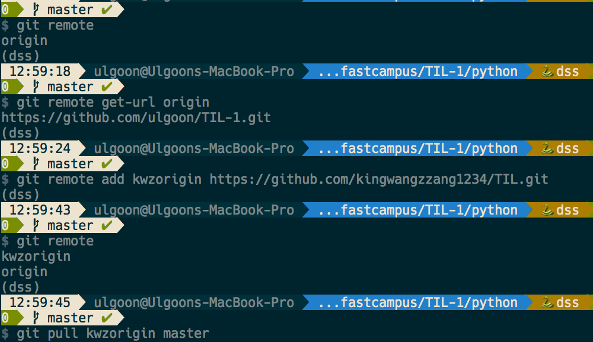

# dss-linux-git

## Homework(190605)

### temporary change

1. ternary operators와 list comprehension으로 fizzbuzz 구현하기
output) if n is assigned to 15,
`[1,2,'fizz', 4, 'buzz', 'fizz', 7, 8, 'fizz', 'buzz', 11, 'fizz', 13, 14, 'fizzbuzz']`

2. TIL 이라는 이름으로 새로운 repository를 만들고 README.md 추가하기

## HOMEWORK(1900612)

1. 맘에드는 짝궁 2명과 팀프로젝트 수행하기

#### Changed part1

## How to install bash on ubuntu on windows

[link](http://blog.neonkid.xyz/90)

## Continuous Pull(Add another origin)

## How to start Hexo

