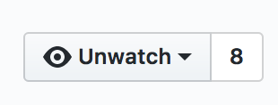

# Fastcampus Data Science SCHOOL
## Linux

---
<!--
page_number: true
$size: A4
footer : fastcampus 데이터 사이언스 스쿨, Wooyoung Choi, 2017
-->
## Introduce
### 최우영

- Solution Architect, Web Developer, Instructor
- Skills: Python, Golang, Julia, Node.js, Google tag manager ...

#### blog: https://blog.ulgoon.com/
#### github: https://github.com/ulgoon/
#### email: me@ulgoon.com


---
## Goal
- Linux의 역사를 이해한다
- CLI에 대한 공포를 극복하고 Shell과 친구가 된다
- Linux Shell 커맨드를 학습하여 능숙하게 이를 활용할 수 있다
- Vim 텍스트 에디터를 통해 파일을 작성하고 매크로를 만들 수 있다

---
## Goal
- git을 이해하고, git과 github이 다름을 인지한다
- git을 활용하여 나의 소스코드를 관리할 수 있다
- 데이터 사이언티스트의 커리어를 스웩할 나만의 멋진블로그를 만들 수 있다
- git의 branch model을 활용해 능숙하게 코드관리할 수 있다
- git으로 타인과 협업하며, 다른 포르젝트에 기여할 수 있다

---
## Linux


---
## Before Linux

- 1965년 데니스 리치, 켄 톰슨 외 x명이 AT&T Bell 연구소에서 PDP-7 기반 어셈블리어로 작성한 UNIX를 개발
 

---
## Before Linux


- 1973년 데니스 리치와 켄 톰슨이 C를 개발한 뒤, C 기반 UNIX 재작성

---
## Before Linux

- 1984년 리차드 스톨먼이 오픈 소프트웨어 자유성 확보를 위한 GNU 프로젝트 돌입

---
### Meaning of GNU

GNU == `G`NU is `N`ot `U`nix

---
## Before Linux

- But, GNU 프로젝트에는 커널이 없었고..

---
### Kernel

- 하드웨어와 응용프로그램을 이어주는 운영체제의 핵심 시스템소프트웨어

---
## Linus Torvalds
<iframe width="860" height="480" src="https://www.youtube.com/embed/IVpOyKCNZYw" frameborder="0" allowfullscreen></iframe>

- 헬싱키 대학생이던 리누스 토발즈는 앤디 타넨바움의 MINIX를 개조한 Linux를 발표
- 0.1 - bash(GNU Bourne Again SHell), gcc(UNIX 기반 C 컴파일러)

---
## Linux
- 리누스 토발즈가 작성한 커널 혹은 GNU 프로젝트의 라이브러리와 도구가 포함된 운영체제
- PC와 모바일, 서버, 임베디드 시스템 등 다양한 분야에서 활용
- Redhat, Debian, Ubuntu, Android 등 다양한 배포판이 존재

---
## Shell
- 운영체제의 커널과 사용자를 이어주는 소프트웨어

- sh(Bourne Shell): AT&T Bell 연구소의 Steve Bourne이 작성한 유닉스 쉘
- csh: 버클리의 Bill Joy가 작성한 유닉스 쉘(C언어랑 비슷한 모양)
- bash(Bourne Again Shell): Brian Fox가 작성한 유닉스 쉘
	- 다양한 운영체제에서 기본 쉘로 채택
- zsh: Paul Falstad가 작성한 유닉스 쉘
	- sh 확장형 쉘
	- 현재까지 가장 완벽한 쉘

---
## Let's learn bash

---
## Shell Command Basic
```
$ cd documents

$ mkdir python - make directory python
$ cd python - change directory
$ cd .. - up to

$ ls
$ ls -al

$ touch hello.py - create hello.py
$ exit - terminate shell

```

---
## chmod
> 파일의 권한을 설정할 때 사용

`drwxr-xr-x`
`d` or `-`: directory or file
(user)(group)(other)
`r`: read
`w`: write
`x`: execute
`-`: no permission

---
## chmod
`$ chmod [옵션] (8진수) (파일명)`
8진수
0: 000
1: 001
2: 010
3: 011
4: 100
5: 101
6: 110
7: 111

---
## Shell Command Basic
```
$ mv hello.py python
$ cp hello.py python

$ rm hello.py
$ rm -rf python/


$ python --version
$ python --help
```


---
## Vim


---
## Vim

Copyright (c) 2007 Laurent Gregoire
- Vi improved Text Editor

---
## Vim Basic

Command
```text
h,j,k,l - move cursor
i - insert mode
v - visual mode
d - delete
y - yank
p - paste
u - undo
r - replace
$ - move end of line
^ - move start of line

:q - quit
:q! - quit w/o write(no warning)
:wq - write and quit

:{number} - move to {number}th line
```

---
### write `hello.py` with Vim
`$ vim`
`$ vim hello.py`

`i`
`-- insert --`
type `print("hello python!")`
press `esc` to escape

`:wq`

`$ python hello.py`

---
### copy & paste
`$ vim hello.py`

`v`
`-- visual --`
블록지정 후 `y`
`p`

press `esc` to escape
`:wq`

`$ python hello.py`

---
### Use macro with Vim 
`$ vim hello.py`
`qa` - a라는 매크로를 생성

`--recording--`이 보이면 매크로 작성

`q` - 매크로 작성 종료

`@a` - a 매크로 실행
`10@a` - a 매크로 10회 실행


---


---
## VCS (Version Control System)
== SCM (Source Code Management)
< SCM (Software Configuration Management: 형상관리)

---
## chronicle of git


---
## chronicle of git
- Linux Kernal을 만들기 위해 Subversion을 쓰다 화가 난 리누스 토발즈는 2주만에 git이라는 버전관리 시스템을 만듦
[git official repo](https://github.com/git/git)

---
## Characteristics of git
- 빠른속도, 단순한 구조
- 분산형 저장소 지원
- 비선형적 개발(수천개의 브랜치) 가능

---
## 데이터 사이언티스트가 git을 잘 써야 하는 이유?

---
## Pros of git
- **중간-발표자료_최종_진짜최종_15-4(교수님이 맘에들어함)_언제까지??_이걸로갑시다.ppt**


- 소스코드 주고받기 없이 동시작업이 가능해져 생산성이 증가
- 수정내용은 **commit** 단위로 관리, 배포 뿐 아니라 원하는 시점으로 **Checkout** 가능
- 새로운 기능 추가는 **Branch**로 개발하여 편안한 실험이 가능하며, 성공적으로 개발이 완료되면 **Merge**하여 반영
- 인터넷이 연결되지 않아도 개발할 수 있음

---
## Open-source project

https://github.com/python/cpython
https://github.com/tensorflow/tensorflow

https://github.com/JuliaLang/julia
https://github.com/golang/go


https://github.com/jkeun

---
## git inside
- Blob: 모든 파일이 Blob이라는 단위로 구성 
- Tree: Blob(tree)들을 모은 것
- Commit: 파일에 대한 정보들을 모은 것

---
## git Process and Command


---
## Useful manager for mac
http://brew.sh/index_ko.html


---
### install git
https://git-scm.com/

```shell
// MacOS
$ brew install git
// Linux
$ sudo apt-get install git
```

- Windows: install [git bash](https://git-scm.com/)

`$ git --version` 으로 정상적으로 설치되었는지를 확인


---
## git is not equal to github


---
### sign up github
https://github.com/


**important!!**
- 가입할 `email`과 `username`은 멋지게
- private repo를 원한다면 $7/month

---
## Important github User Interface

---
### Star


### watch


---
## Set configuration
terminal
```shell
$ git config --global user.name "username"
$ git config --global user.email "github email address"
$ git config --list
```

---
## My First Repo
Let's make your first repo with github

---
## My First Repo
`$ git init`
`$ git add .`
`$ git commit -m "some commit"`

After create new repo through github,

`$ git remote add origin https://github.com/username/repo.git`
`$ git push origin master`
