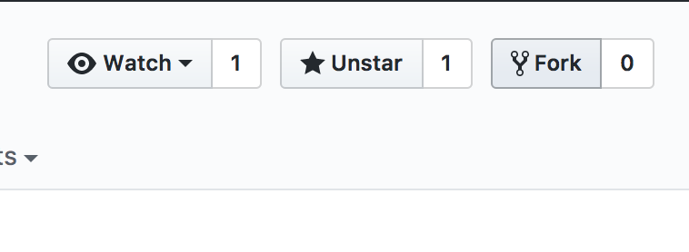
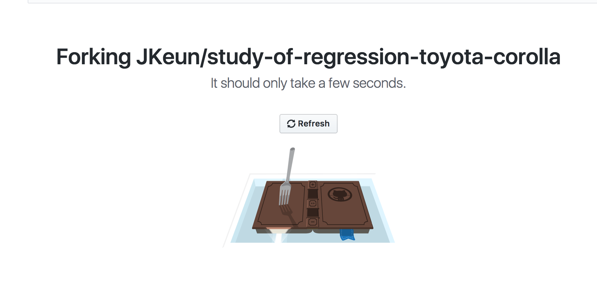
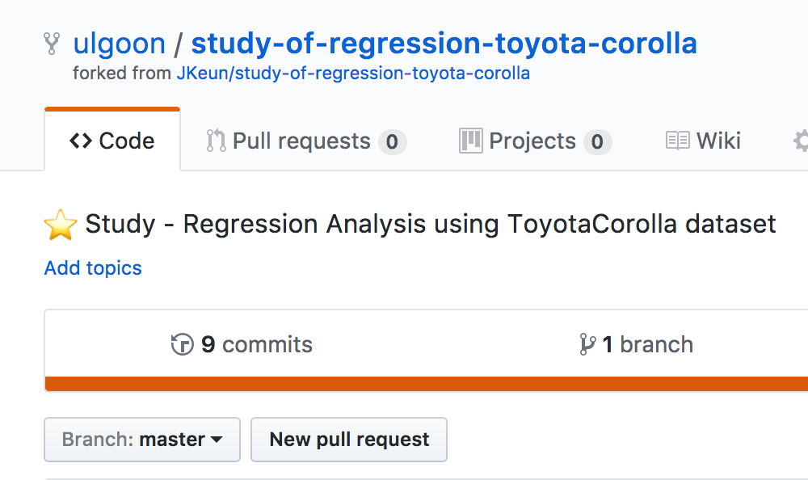
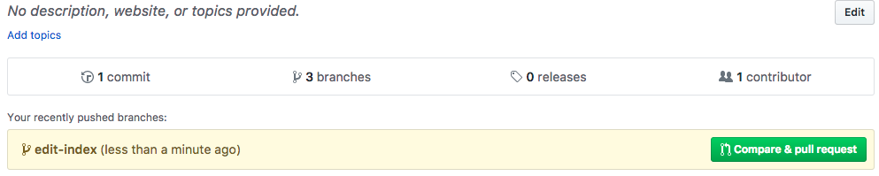
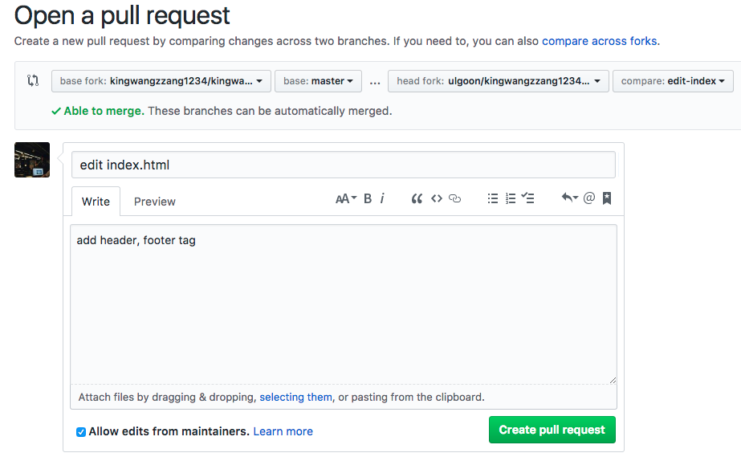
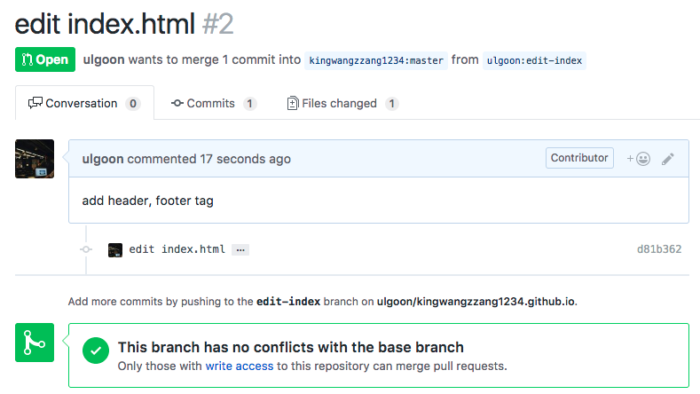
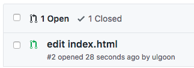
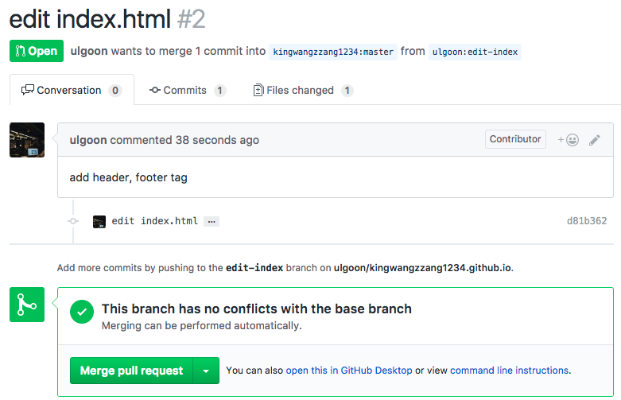
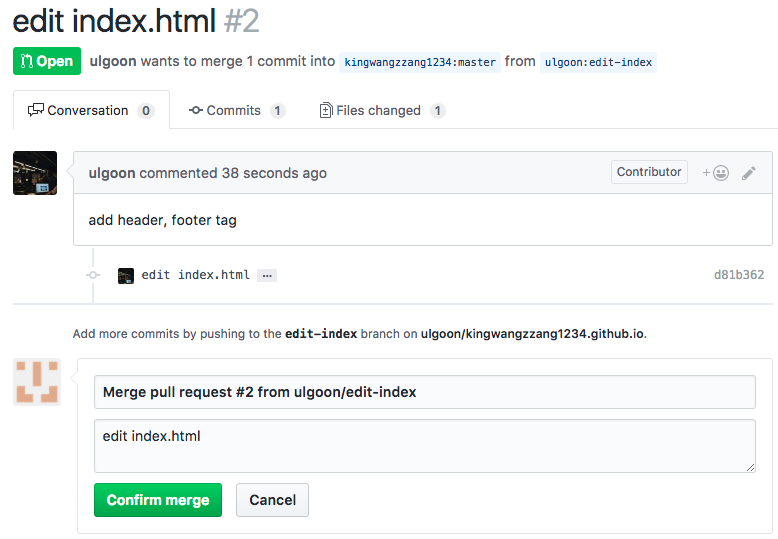
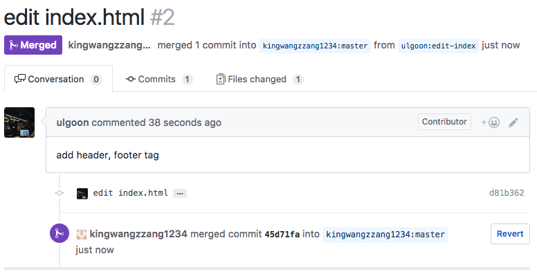

# Fastcampus Data Science SCHOOL
## git

---
<!--
page_number: true
$size: A4
footer : fastcampus 데이터 사이언스 스쿨, Wooyoung Choi, 2018
-->

## github pages

---
## My First Github Pages
github 저장소를 활용해 정적인 사이트 호스팅이 가능

`username`.github.io 
http://tech.kakao.com/
https://spoqa.github.io/

---
### sample index page
After create new repo throuch github,

`$ git clone https://github.com/username/username.github.io.git`

Create New file `index.html`

`$ git add .`
`$ git commit -m "first page"`
`$ git push origin master`

---
### sample index page
```html
<!doctype html>
<html>
 <head>
  <meta charset="utf-8">
  <title>My first gh page</title>
 </head>
 <body>
  <h1>Home</h1>
  <p>Hello, there!</p>
 </body>
</html>
```


---
### Static Site Generator
- [Jekyll](https://jekyllrb.com/): Ruby 기반 정적인 블로그 생성기
	- 설치와 사용이 쉬움
	- 사용자가 많았음 
- [Hugo](https://gohugo.io/): Golang 기반 정적인 블로그 생성기
	- 빠른 속도로 사이트를 생성
	- 사용자 증가 중
- [Hexo](https://hexo.io/): Node.js 기반 정적인 블로그 생성기
	- Node.js를 안다면 커스터마이즈가 쉬움
	- 빠른 속도로 사용자 증가 중

**Recommand**
`Jekyll` > `Hugo` > `Hexo`

---
## What is branch?

---
## What is branch?


---
## What is branch?
분기점을 생성하고 독립적으로 코드를 변경할 수 있도록 도와주는 모델

ex)

master branch
```python
print('hello world!')
```

another branch
```python
for i in range(1,10):
    print('hello world for the %s times!' % i)
```


---
## Branch

Show available local branch
`$ git branch`

Show available remote branch
`$ git branch -r`

Show available All branch
`$ git branch -a`

---
## Branch


Create branch
`$ git branch stem`

Checkout branch
`$ git checkout stem`

Create & Checkout branch
`$ git checkout -b new-stem`

make changes inside readme.md
`$ git commit -a -m 'edit readme.md'`
`$ git checkout master`

merge branch
`$ git merge stem`

---
## Branch

delete branch
`$ git branch -D stem`

push with specified remote branch
`$ git push origin stem`

see the difference between two branches
`$ git diff master stem`

---
## git flow strategy


---
## use git flow easily!
[Link](https://danielkummer.github.io/git-flow-cheatsheet/index.ko_KR.html)


---
## Collaborate with your Co-worker

---
## Method 1: Collaboration
Add Collaborator


---
## Collaboration
Add, Commit and Push like you own it. 

---
## Method 2: Fork and Merge


---
## Fork and Merge


---
## Fork and Merge


---
## Fork and Merge
`$ git clone https://github.com/username/forked-repo.git`


---
## Fork and Merge


`$ git branch -a`
`$ git checkout -b new-feature`

---
## Fork and Merge

Make some change

`$ git add file`
`$ git commit -m "commit message"`
`$ git push origin new-feature`

---
## Fork and Merge


---
## Fork and Merge


---
## Fork and Merge


---
## Fork and Merge


---
## Fork and Merge


---
## Fork and Merge


---
## Fork and Merge



---
## continuous pull

---
## continuous pull

`$ git remote add upstream https://github.com/anotheruser/original-repo.git`

`$ git fetch upstream`
`$ git merge upstream/master`
